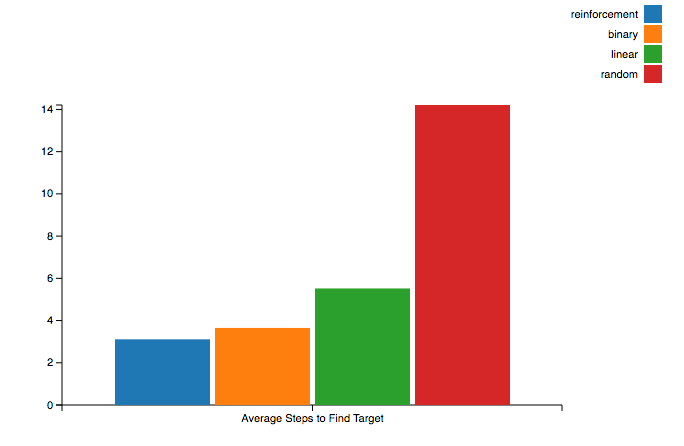

title: Reinforcement Learning in Python
author:
  name: Nathan Epstein
  twitter: epstein_n
  url: http://nepste.in

--

# Reinforcement Learning in Python

--

### Roadmap

- Concepts
- Using Data
- Python Implementation
- Sample Application

--

# Concepts

--

### Reinforcement Learning

Reinforcement learning is a type of machine learning in which software agents are trained to take actions in a given environment to maximize a cumulative reward.

--

### Markov Decision Process - Components

A Markov Decision process is a mathematical formalism that we will use to implement reinforcement learning. The relevant components of this formalism are
the __state space__, __action space__, __transition probabilities__, and __rewards__.

--

### State Space

The exhaustive set of possible states that a process can be in. Generally known a priori.

--

### Action Space

The exhaustive set of possible actions that can be taken (to influence the likelihood of transition between states). Generally known a priori.

--

### Transition Probabilities

The probabilities of transitioning between the various states given actions taken (specifically, a tensor, P, such that P_ijk = probabilitiy of going from state i to state k given action j). Generally not known a priori.

--

### Rewards

The rewards associated with occupying each state. Generally not known a priori.

--

### Markov Decision Process - Objectives

We are interested in understanding these elements in order to develop a __policy__; the set of actions we will take in each state.

Our goal is to determine a policy which produces the greatest possible cumulative rewards.

--

# Using Data

--

### Objectives

Our goal is to learn the transition probabilities and the rewards (and build a policy based on these rewards). We will estimate these values using observed data.

--

### Estimating Rewards

R(s) = (total reward we got in state s) / (#times we visited state s)

--

### Estimating Transition Probability

P(s, a, s') = (#times we took action a in state s and we went to s') / (#times we took action a in state s)

--

### Value Iteration

Value Iteration is an algorithm by which we can use the estimated rewards and transition probabilities to determine an optimal policy.

--

### Value Iteration - algorithm

1) For each state s, initialize V(s) = 0

2) Repeat until convergence:

For each state, update V(s) = R(s) + max_a∈A SUM_s'∈S(P(s, a, s') * V(s'))

3) Policy in state s is the a ∈ A which maximizes V(s)

--

# Python Implementation

--

### Reward Parser

```python

import numpy as np

class RewardParser:
  def __init__(self, observations, dimensions):
    self.observations = observations
    self.state_count = dimensions['state_count']

  def rewards(self):
    total_state_rewards = np.zeros(self.state_count)
    total_state_visits = np.zeros(self.state_count)

    for observation in self.observations:
      visits = float(len(observation['state_transitions']))
      reward_per_visit = observation['reward'] / visits

      for state_transition in observation['state_transitions']:
        state = state_transition['state']
        total_state_rewards[state] += reward_per_visit
        total_state_visits[state] += 1

    average_state_rewards = total_state_rewards / total_state_visits
    average_state_rewards = np.nan_to_num(average_state_rewards)

    return average_state_rewards

```

--

### Transition Parser (part 1)

```python

import numpy as np

class TransitionParser:
  def __init__(self, observations, dimensions):
    self.observations = observations
    self.state_count = dimensions['state_count']
    self.action_count = dimensions['action_count']

  def transition_probabilities(self):
    transition_count = self._count_transitions()
    return self._parse_probabilities(transition_count)

```

--

### Transition Parser (part 2)

```python

  def _count_transitions(self):
    transition_count = np.zeros((self.state_count, self.action_count, self.state_count))

    for observation in self.observations:
      for state_transition in observation['state_transitions']:
        state = state_transition['state']
        action = state_transition['action']
        state_ = state_transition['state_']

        transition_count[state][action][state_] += 1

    return transition_count

  def _parse_probabilities(self, transition_count):
    P = np.zeros((self.state_count, self.action_count, self.state_count))

    for state in range(0, self.state_count):
      for action in range(0, self.action_count):

        total_transitions = float(sum(transition_count[state][action]))

        if (total_transitions > 0):
          P[state][action] = transition_count[state][action] / total_transitions
        else:
          P[state][action] = 1.0 / self.state_count

    return P

```

--

### Policy Parser

```python

import numpy as np

class PolicyParser:
  def __init__(self, dimensions):
    self.state_count = dimensions['state_count']
    self.action_count = dimensions['action_count']

  def policy(self, P, rewards):
    best_policy = np.zeros(self.state_count)
    state_values = np.zeros(self.state_count)

    GAMMA, ITERATIONS = 0.9, 50
    for i in range(ITERATIONS):
      for state in range(0, self.state_count):
        state_value = -float('Inf')
        for action in range(0, self.action_count):
          action_value = 0
          for state_ in range(0, self.state_count):
            action_value += (P[state][action][state_] * state_values[state_] * GAMMA)
          if (action_value >= state_value):
            state_value = action_value
            best_policy[state] = action
        state_values[state] = rewards[state] + state_value
    return best_policy

```

--

### Putting It Together (Markov Agent)

```python

from rewards import RewardParser
from transitions import TransitionParser
from policy import PolicyParser

class MarkovAgent:
  def __init__(self, observations, dimensions):
    # create reward, transition, and policy parsers
    self.reward_parser = RewardParser(observations, dimensions)
    self.transition_parser = TransitionParser(observations, dimensions)
    self.policy_parser = PolicyParser(dimensions)

  def learn(self):
    R = self.reward_parser.rewards()
    P = self.transition_parser.transition_probabilities()

    self.policy = self.policy_parser.policy(P, R)

```
--

# Sample Application

--

### Climbing

- 5 states: bottom, low, middle, high, top.
- No leaving bottom and top.
- We get a reward at the top, nothing at the bottom.

--

### Data - observations

```python

observations = [
  { 'state_transitions': [
      { 'state': 'low', 'action': 'climb', 'state_': 'mid' },
      { 'state': 'mid', 'action': 'climb', 'state_': 'high' },
      { 'state': 'high', 'action': 'sink', 'state_': 'mid' },
      { 'state': 'mid', 'action': 'sink', 'state_': 'low' },
      { 'state': 'low', 'action': 'sink', 'state_': 'bottom' }
    ],
    'reward': 0
  },
  { 'state_transitions': [
      { 'state': 'low', 'action': 'climb', 'state_': 'mid' },
      { 'state': 'mid', 'action': 'climb', 'state_': 'high' },
      { 'state': 'high', 'action': 'climb', 'state_': 'top' },
    ],
    'reward': 0
  }
]

```

--

### Data - trap states

```python

trap_states = [
  {
    'state_transitions': [
      { 'state': 'bottom', 'action': 'sink', 'state_': 'bottom' },
      { 'state': 'bottom', 'action': 'climb', 'state_': 'bottom' }
    ],
    'reward': 0
  },
  {
    'state_transitions': [
      { 'state': 'top', 'action': 'sink', 'state_': 'top' },
      { 'state': 'top', 'action': 'climb', 'state_': 'top' },
    ],
    'reward': 1
  },
]

```

--

### Training

```python
from learn import MarkovAgent
mark = MarkovAgent(observations + trap_states)
mark.learn()

print(mark.policy)
# {'high': 'climb', 'top': 'sink', 'bottom': 'sink', 'low': 'climb', 'mid': 'climb'}
# NOTE: policy in top and bottom states is chosen randomly (doesn't affect state)

```

--

### Search

- Given an array of sorted numbers, find a target value.
- Do this as quickly as possible.

--

### Approach

- Create many example searches (random, linear, and binary).
- Reward for each search should be -1 * #steps to find target.
- Append these with trap states with positive rewards.

Note: You can find the search code at https://github.com/NathanEpstein/pydata-reinforce/blob/master/search.py

--

### Training

```python
from learn import MarkovAgent
from search import *
import numpy as np

simulator = SearchSimulation()
observations = simulator.observations(100000, 20)
mark = MarkovAgent(observations)
mark.learn()


class AISearch(Search):
  def update_location(self):
    self.location = mark.policy[self.state()]

```

--

### Comparison

```python

binary_results = []
linear_results = []
random_results = []
ai_results = []

for i in range(10000):
  # generate the array and target value
  array = simulator._random_sorted_array(20)
  target = random.choice(array)
  # generate observation for search of each type
  binary = simulator.observation(20, supplied_search = BinarySearch(array, target))
  linear = simulator.observation(20, supplied_search = LinearSearch(array, target))
  rando = simulator.observation(20, supplied_search = RandomSearch(array, target))
  ai = simulator.observation(20, supplied_search = AISearch(array, target))
  # append result
  binary_results.append(len(binary['state_transitions']))
  linear_results.append(len(linear['state_transitions']))
  random_results.append(len(rando['state_transitions']))
  ai_results.append(len(ai['state_transitions']))

# display results
print "Average binary search length: {0}".format(np.mean(binary_results)) # 3.9984
print "Average linear search length: {0}".format(np.mean(linear_results)) # 7.2012
print "Average random search length: {0}".format(np.mean(random_results)) # 19.4402
print "Average AI search length: {0}".format(np.mean(ai_results)) # 4.2267


```

--

### Results




